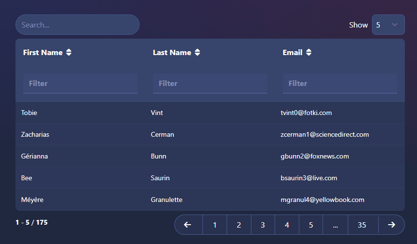

# Skeleton 🤝 Svelte Simple Datatables Starter

[Svelte Simple Datatable](https://vincjo.fr/datatables/home) components styled with [Skeleton](https://www.skeleton.dev/).

## Examples

### `<Datatable />`



### Accessory Components


## Developing

To get started - clone the repo, install dependencies, and start the dev instance.

```bash
git clone https://github.com/skeletonlabs/skeleton-datatables-integration.git

cd skeleton-datatables-integration

pnpm i

pnpm dev
```

This is an opinionated template, which uses Skeleton, Typescript and pnpm. If you prefer to start from scratch, or add to an existing project, then you can follow the [official guide in the Skeleton Docs](https://www.skeleton.dev/docs/ssd).
