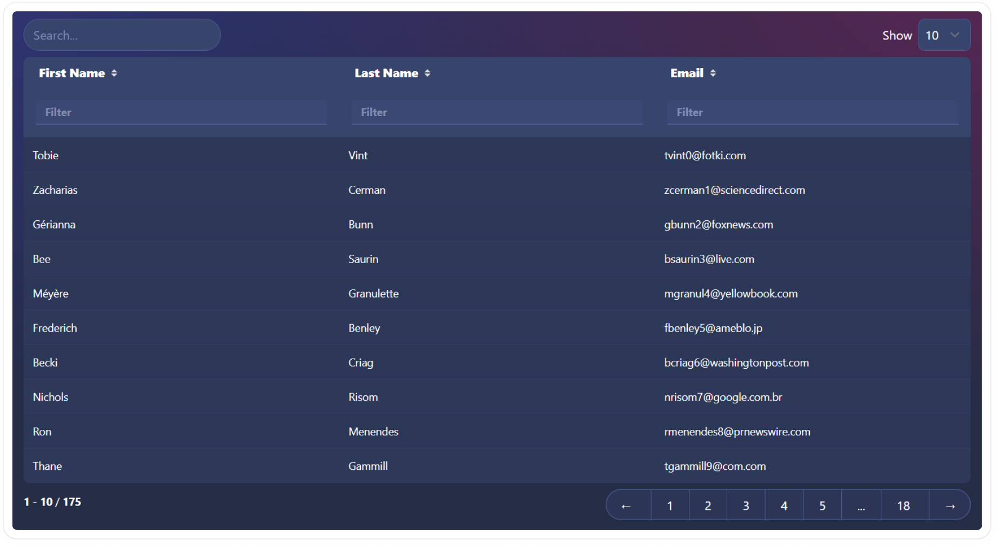

# simple-datatables-skeleton

A headless datatable using [Svelte Simple Datatables](https://vincjo.fr/datatables/home) styled with [Skeleton UI](https://www.skeleton.dev/) & [Tailwind CSS](https://tailwindcss.com/).



## Developing

```bash
pnpm i
pnpm dev
```
